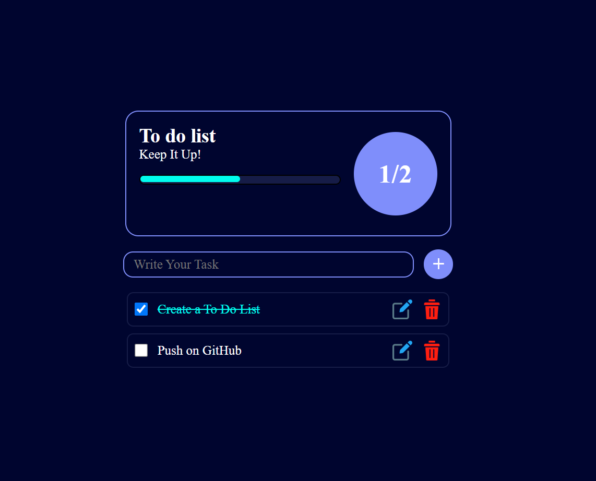

# 📝 To-Do List Application

A simple and interactive To-Do List application built using HTML, CSS, and JavaScript. This app allows users to add, mark, and delete tasks, with data persistence using `localStorage`.

## 🚀 Features

- **Add Tasks**: Easily add new tasks to your list.
- **Mark as Completed**: Click on tasks to mark them as completed.
- **Delete Tasks**: Remove tasks that are no longer needed.
- **Persistent Storage**: Tasks are saved in your browser's `localStorage`.
- **Responsive Design**: Optimized for various screen sizes.

## 🔗 Live Demo

Check out the live version of the project here:  
👉 [Live Demo](https://github.com/SumitNarwade24/To-do-List/) 👈


## 🛠️ Technologies Used

- **HTML5**: Markup language for structuring the application.
- **CSS3**: Styling the application for a clean and responsive design.
- **JavaScript (ES6)**: Adding interactivity and handling data storage.

## 📂 Project Structure

todo-list/ ├── index.html ├── styles.css ├── script.js ├── README.md 


## 📸 Screenshots




## 🔧 Installation and Usage

1. **Clone the Repository**:
   ```bash
   git clone https://github.com/SumitNarwade24/To-do-List.git
